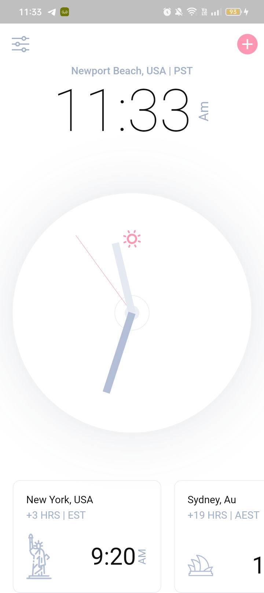
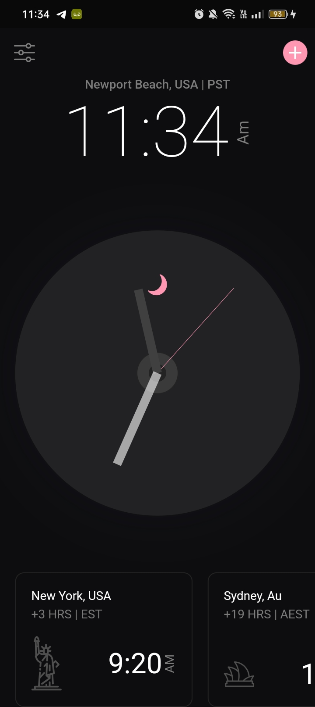

# Analog Clock Light & Dark Theme

- clean analog clock app UI by using flutter. clock supports both the Dark and Light theme.

## 🔌 Packages
- flutter_svg: [link](https://pub.dev/packages/flutter_svg)
- google_fonts: [link](https://pub.dev/packages/google_fonts)
- provider: [link](https://pub.dev/packages/provider)

## 📸 ScreenShots
| Light                                          | Dark                                           |
| ---------------------------------------------- | -----------------------------------------------|
|  |   |

